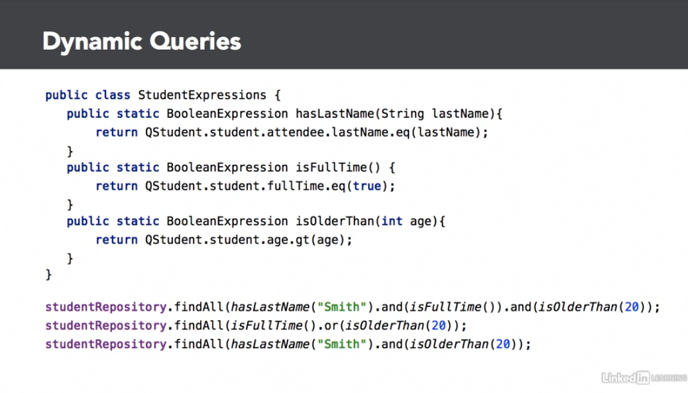

# Spring Data

## Spring Data Rest Repositories
- Adding this dependency (`spring-boot-starter-data-rest`) instantly exposes a basic REST API based on your existing
  data repositories
- Base path for generated REST API: `spring.data.rest.base-path=api/rest`

## Repositories
- `JpaRepository` is built on top of `CrudRepository`
    - CRUD + flush + saveAndFlush + deleteInBatch + deleteAllInBatch
- `PagingAndSortingRepository` built on top of `CrudRepository`
    - CRUD + paging
- Can create custom Repository such as `ReadOnlyRepository
  `
## Simple Query Method Property Expression Rules
1. Return `type`
2. start with `findBy` (?)
3. include attribute name of Java obj (camel case)
    - Ex: `findByAge`
4. Optionally, chain subattribute names
    - Ex: `findByAttendeeLastName`
    - Where attendee is an object on the Student class
- Examples found in `university` module `QueryDemos`
    
## Spring Data JDBC Repository
- Interact with relational DBs without JPA (Hibernate/ORM)

- JPA Pros
    - Lazy loading, caching, dirty tracking
- JPA Cons
    - Expensive SQL statements
    - point of operator persistent not obvious (?)
    

- Simple JDBC Pros
    - Simpler model, SQL issued only when needed, fully loaded object
- Simply JDBC Cons
    - Many to one and many to many relationships are not supported

## Reactive Stack
- Non blocking IO, leverages multi-core processes for concurrent
connections
  
## Other Spring Data Sources
- Spring Data Redis
- Spring Data LDAP
- Spring Data Key Value

## Query DSL
- Use `BooleanExpression` (`Predicate`) to simply queries
